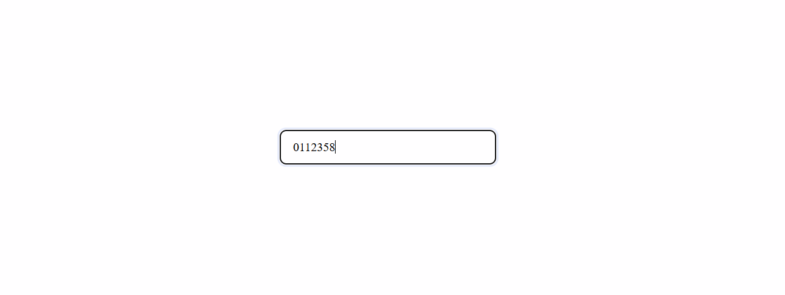
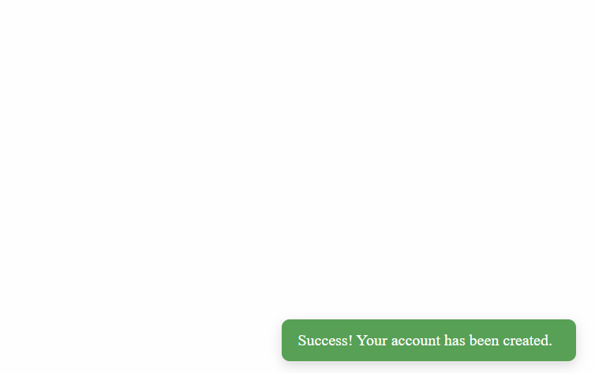
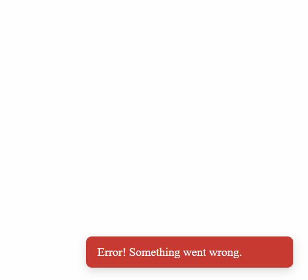
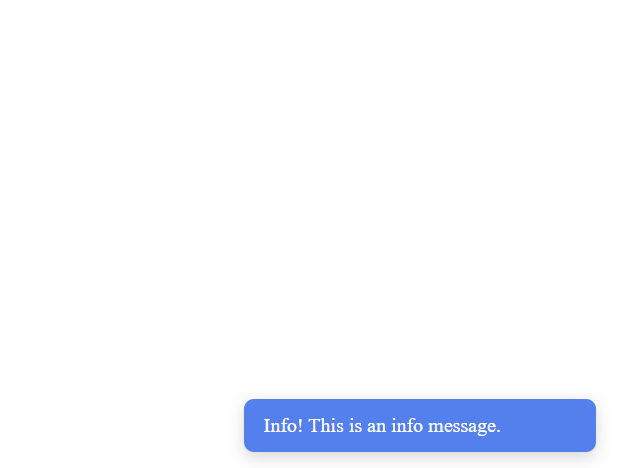
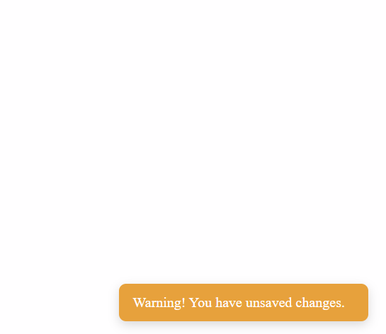
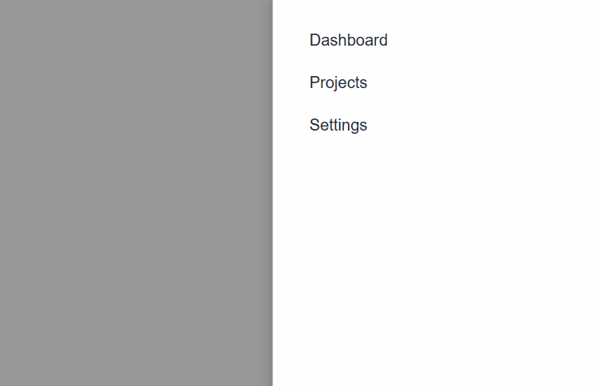
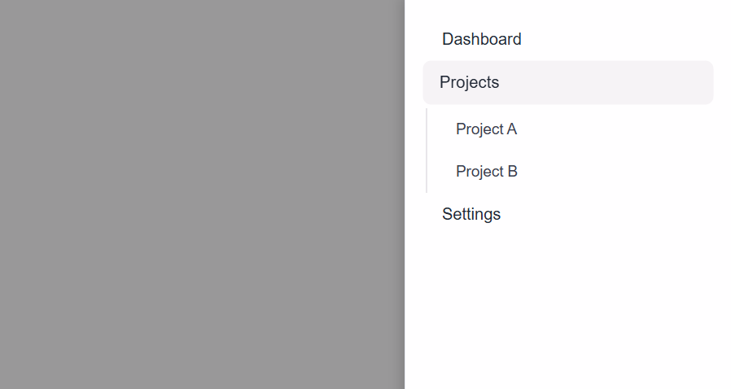

# React Component Library

This is a small **React component library** built with **TypeScript** and **Storybook**. It includes three reusable UI components with multiple states and props.

## Setup Instructions

1. Install dependencies:  
   npm install

2. Run Next.js locally:  
   npm run dev

3. Run Storybook to view components:  
   npm run storybook

4. Build Storybook (optional):  
   npm run build-storybook

---

## Components Overview

### 1. Input

Multi-type input component with:

- Text, password, or number type
- Password visibility toggle
- Clearable input

**Stories:** Default, Password, Clearable, Number

**Screenshots:**  
Default:   
Password:   
Clearable:   
Number: 

---

### 2. Toast

Notification component with:

- Success, Error, Info, Warning types
- Auto-hide after a delay
- Optional manual close

**Stories:** Success, Error, Info, Warning

**Screenshots:**  
Success:   
Error:   
Info: 
Warning: 

---

### 3. SidebarMenu

Nested sidebar menu with sliding animation:

- Parent items with optional children
- Toggle submenus
- Backdrop click closes menu

**Stories:** Default, Nested items open/closed, Animated slide

**Screenshots:**  
One level:   
Two level: 

---

## Notes

- All stories are located in `src/stories/`
- Components are in `src/components/`
